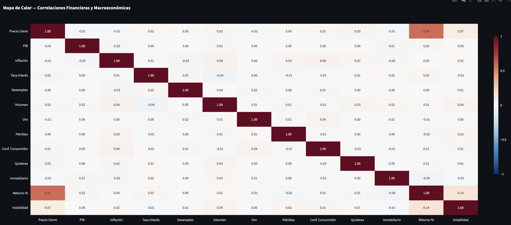
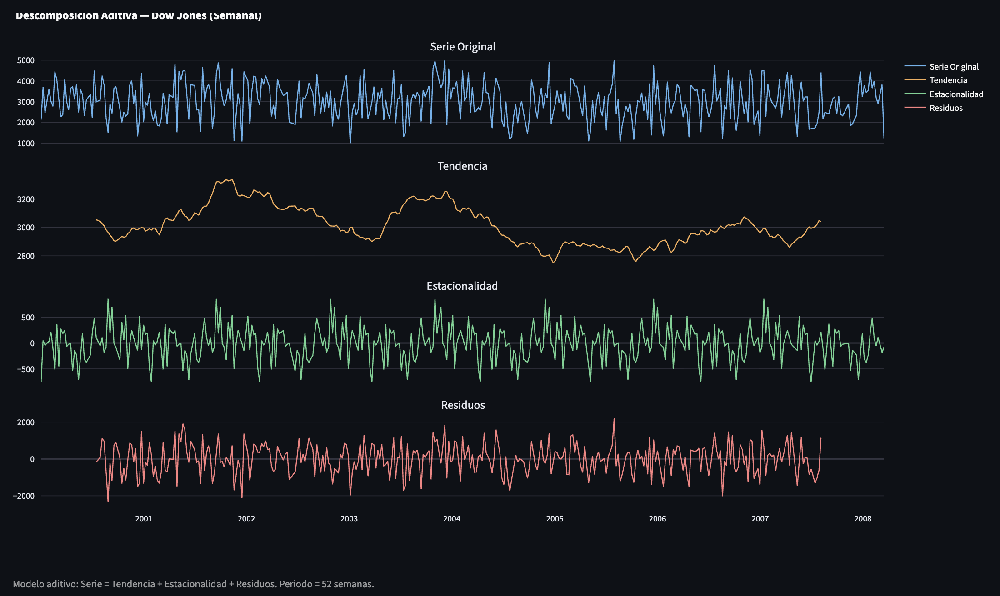
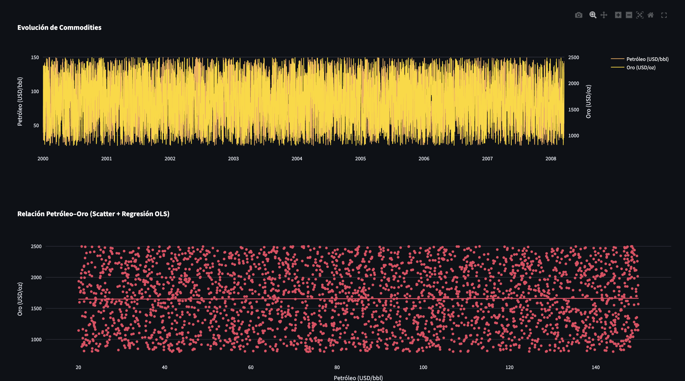
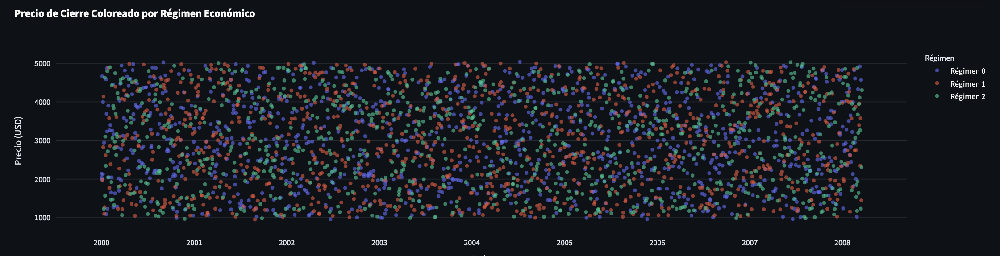
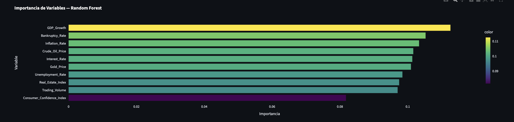

## TrabajoG11-C3
Ejercicio Práctico Grupo 11 - Tratamiento de Datos

# 📈 Dashboard Inteligencia Financiera y Macroeconómica Avanzada

Dashboard interactivo de análisis financiero y macroeconómico desarrollado con **Streamlit**, que integra un pipeline ETL completo, análisis exploratorio, indicadores técnicos avanzados y modelos de Machine Learning.

---

## 📋 Descripción General

Este proyecto transforma datos históricos de mercados bursátiles (Dow Jones, S&P 500, NASDAQ) junto con variables macroeconómicas globales (2000–2008) en inteligencia accionable a través de:

- **Pipeline ETL automatizado** con limpieza, imputación y feature engineering
- **Análisis Exploratorio (EDA)** con correlaciones, distribuciones y descomposición estacional
- **Análisis Técnico** con velas japonesas OHLC, RSI, Bandas de Bollinger y MACD
- **Machine Learning** supervisado (Random Forest, Gradient Boosting) y no supervisado (K-Means)
- **Persistencia SQL** en SQLite con consola de consultas integrada

---

## 🗂️ Estructura del Proyecto

```
TrabajoG11-C3/
├── app.py                          # Aplicación principal Streamlit
├── Data/
│   └── finance_economics_dataset.csv  # Dataset principal (3,000 registros, 24 variables)
├── economics_all.db               # Base de datos SQLite (generada en runtime)
├── requirements.txt               # Dependencias del proyecto
└── README.md                      # Este archivo
```

---

## 📦 Dataset

**Fuente:** `Data/finance_economics_dataset.csv`  
**Registros:** 3,000 | **Variables:** 24 | **Periodo:** 2000-01-01 → 2008-03-18  
**Índices:** Dow Jones, S&P 500, NASDAQ

### Propósito del Dataset

El dataset integra series históricas de los tres principales índices bursátiles estadounidenses con variables macroeconómicas globales durante el período 2000–2008, un ciclo que abarca tres regímenes económicos diferenciados: la burbuja y colapso dot-com (2000–2002), la expansión sostenida (2003–2006) y la acumulación de riesgo sistémico previo a la crisis subprime (2007–2008).

**Objetivo:** Estudiar la relación entre indicadores macroeconómicos (inflación, tasas, PIB, desempleo) y el comportamiento del mercado financiero, identificar patrones técnicos recurrentes y construir modelos predictivos de precio basados en variables fundamentales. El periodo elegido es deliberado: incluye dos shocks de mercado con causas estructuralmente distintas, lo que permite contrastar la capacidad explicativa del modelo en condiciones de estabilidad y de estrés financiero.

### Variables disponibles

| Categoría | Variables |
|-----------|-----------|
| **Precio** | Open Price, Close Price, Daily High, Daily Low |
| **Mercado** | Trading Volume, Stock Index |
| **Macro** | GDP Growth, Inflation Rate, Unemployment Rate, Interest Rate |
| **Consumo** | Consumer Confidence Index, Retail Sales, Consumer Spending |
| **Deuda/Corp** | Government Debt, Corporate Profits, Bankruptcy Rate |
| **M&A / VC** | Mergers & Acquisitions Deals, Venture Capital Funding |
| **Forex** | USD/EUR, USD/JPY |
| **Commodities** | Crude Oil Price, Gold Price, Real Estate Index |

---

## 🔄 Pipeline ETL — Limpieza y Transformación

Todo el proceso se ejecuta en la función `cargar_y_procesar()` de `app.py`. Los pasos son secuenciales: cada uno depende del anterior.

---

### Paso 1 — Lectura del CSV

```python
df = pd.read_csv("Data/finance_economics_dataset.csv")
```

Carga directa del archivo fuente. Los 3,000 registros ingresan con columnas de tipo `object` (texto) por defecto.

---

### Paso 2 — Normalización de nombres de columna

```python
c.strip().replace(' ', '_').replace('(%)', '').replace('(Billion_USD)', '') ...
```

Los nombres originales del CSV contienen espacios, unidades entre paréntesis (`(%)`), símbolos especiales (`/`, `&`) y dobles guiones bajos. Este paso los convierte a `snake_case` limpio sin caracteres problemáticos, lo que permite acceder a las columnas con notación de atributo y evita errores en SQL.

**Ejemplo:** `GDP Growth (%)` → `GDP_Growth`

---

### Paso 3 — Conversión de tipos

```python
df['Date'] = pd.to_datetime(df['Date'])
df = df.sort_values('Date').reset_index(drop=True)
df[cols_num] = pd.to_numeric(df[cols_num], errors='coerce')
```

- La columna `Date` se convierte a `datetime64[ns]` para habilitar operaciones de series temporales (rolling, resample, descomposición STL).
- El dataset se ordena cronológicamente antes de cualquier otra operación — requisito indispensable para que `ffill` y las ventanas móviles sean temporalmente consistentes.
- Todas las columnas numéricas se fuerzan a `float64`; valores no parseables se convierten a `NaN` (flag para el paso siguiente).

---

### Paso 4 — Imputación temporal (ffill + bfill)

```python
df[cols_num] = df[cols_num].ffill().bfill()
```

Estrategia de dos pasadas:
- **`ffill` (forward fill):** propaga el último valor conocido hacia adelante. Apropiado para series financieras donde un valor faltante en un día de no-operación se reemplaza con el cierre anterior.
- **`bfill` (backward fill):** cubre los `NaN` que quedan al inicio de la serie (donde no hay valor anterior). Aplicado solo si `ffill` no los eliminó.

Se eligió imputación temporal sobre imputación por media/mediana para preservar la autocorrelación de las series — crítico para el cálculo correcto de indicadores técnicos en el paso 6.

---

### Paso 5 — Winsorización por IQR

```python
q1, q3 = df[c].quantile(0.25), df[c].quantile(0.75)
iqr = q3 - q1
df[c] = df[c].clip(lower=q1 - 1.5*iqr, upper=q3 + 1.5*iqr)
```

Los valores extremos (outliers) se recortan a los límites del rango intercuartílico extendido (1.5×IQR), equivalente a los bigotes de un boxplot estándar. Esto limita su influencia en los modelos de ML sin eliminar filas, manteniendo los 3,000 registros íntegros.

**Por qué no eliminación:** en series temporales financieras, un outlier genuino (crash del 2001, pico de petróleo 2007) contiene información relevante del ciclo. Winsorizar preserva la señal pero evita que domine la regresión.

---

### Paso 6 — Feature Engineering por índice

El bloque se ejecuta por separado para cada `Stock_Index` (Dow Jones, S&P 500, NASDAQ) para evitar contaminación entre series al calcular ventanas móviles.

| Variable nueva | Cálculo | Propósito |
|---|---|---|
| `MA_20_Close` | Media móvil 20 días | Tendencia de corto plazo |
| `MA_50_Close` | Media móvil 50 días | Tendencia de mediano plazo |
| `MA_200_Close` | Media móvil 200 días | Tendencia estructural (bull/bear) |
| `RSI_14` | RSI 14 períodos (EMA de ganancias/pérdidas) | Momentum y zonas de sobrecompra/sobreventa |
| `BB_sup / BB_med / BB_inf` | Bollinger Bands (20p, ±2σ) | Volatilidad y rango de precio esperado |
| `MACD / MACD_Signal / MACD_Hist` | MACD (12, 26, 9) | Cambio de momentum y cruces de señal |
| `Retorno_Diario` | `pct_change()` × 100 | Retorno porcentual diario para análisis de distribución |
| `Volatilidad_20d` | Desviación estándar rodante 20 días de `Retorno_Diario` | Régimen de riesgo |
| `GDP_YoY` | `pct_change(252)` sobre `GDP_Growth` | Crecimiento interanual del PIB (252 = sesiones bursátiles anuales) |

---

### Paso 7 — Índice Macroeconómico Sintético (PCA)

```python
cols_pca = ['Inflation_Rate', 'Interest_Rate', 'Unemployment_Rate']
pca = PCA(n_components=1)
df['Indice_Macro_Sintetico'] = pca.fit_transform(
    StandardScaler().fit_transform(df[cols_pca])
)
```

Las tres variables macro con mayor correlación entre sí se comprimen en un único componente principal mediante PCA. Antes de aplicar PCA se estandarizan con `StandardScaler` (media 0, desviación estándar 1) para que ninguna variable domine por escala.

El resultado `Indice_Macro_Sintetico` condensa el "estado macroeconómico" en un solo número, reduciendo multicolinealidad en los modelos supervisados.

---

### Paso 8 — Eliminación final y persistencia

```python
df = df.dropna(subset=['Close_Price', 'Open_Price'])
df.to_sql('indicadores', engine, if_exists='replace', index=False)
```

Se eliminan las filas donde `Close_Price` u `Open_Price` siguen siendo `NaN` tras la imputación (típicamente los primeros registros de cada índice antes de la ventana MA_200). El DataFrame resultante se persiste en SQLite tabla `indicadores` vía SQLAlchemy, reemplazando la tabla en cada ejecución.

---

## 🖥️ Secciones del Dashboard

### 🏠 Inicio y Resumen
- KPIs dinámicos (precio promedio, máximo, volatilidad, inflación, PIB)
- Gráfico comparativo de índices
- Distribución de retornos
- Estadísticas descriptivas
- Hallazgos y conclusiones estratégicas basados en correlaciones calculadas en tiempo real

### 📊 Análisis Visual (EDA)
- **Correlaciones:** heatmap interactivo de todas las variables + top 5 por relevancia
- **Distribuciones:** histograma de retornos superpuesto, violin plot de volumen
- **Series Temporales:** descomposición STL aditiva (tendencia + estacionalidad + residuos)
- **Commodities:** evolución Petróleo/Oro con eje dual + scatter de regresión OLS

### 📈 Análisis Técnico
- **Candlestick OHLC** con volumen coloreado, MA(20) y MA(50), Bandas de Bollinger
- **RSI (14p)** con zonas de sobrecompra/sobreventa visualizadas
- **MACD (12,26,9)** con línea de señal e histograma bicolor

### 🤖 Machine Learning
- **K-Means** clustering 3D de regímenes económicos (configurable 2–6 clústeres)
- **Random Forest / Gradient Boosting** con train/test split configurable
  - Métricas: R², MAE, RMSE
  - Gráfico predicción vs. realidad en serie temporal
  - Importancia de características (feature importance)
- **Simulador de escenarios**: entrada interactiva de variables macro → predicción de precio

### 🗄️ Base de Datos
- Vista previa de tabla `indicadores` (SQLite, sin pyarrow)
- Consola SQL con validación de seguridad (solo SELECT)
- Ejemplos de consultas predefinidas
- Exportación CSV del dataset filtrado y del resumen estadístico
- Visualización del esquema PRAGMA de la tabla

---

## ⚙️ Instalación y Ejecución

### Requisitos
- Python 3.8+
- Las dependencias listadas en `requirements.txt`

### Instalar dependencias

```bash
pip install -r requirements.txt
```

### Ejecutar la aplicación

```bash
streamlit run app.py
```

La aplicación abrirá automáticamente en `http://localhost:8501`

---

## 📚 Dependencias Principales

```
streamlit>=1.28
pandas>=1.5
numpy>=1.23
plotly>=5.15
scikit-learn>=1.2
statsmodels>=0.14
sqlalchemy>=2.0
```

> **Nota:** No se requiere `pyarrow`. La visualización de datos en la sección de Base de Datos
> utiliza conversión explícita a `dict` + `DataFrame` para compatibilidad con versiones antiguas
> de Streamlit que no soportan Apache Arrow.

---

## 🐛 Correcciones Aplicadas en esta Versión

| Problema | Solución |
|----------|----------|
| Velas sin mechas (High/Low) | `xaxis type='date'` en lugar de `'category'` + uso de `go.Candlestick` con `whiskerwidth=0.8` |
| `No module named 'pyarrow'` | Eliminada dependencia de Arrow; datos servidos como `list[dict]` → `pd.DataFrame` |
| Ícono/imagen de sidebar mostrando "0" | Reemplazado por SVG embebido (sin URL externa) |
| Análisis limitado | Agregados: análisis técnico completo, descomposición STL, commodities, MACD, Gradient Boosting, simulador mejorado |

---

## 💡 Hallazgos Principales

1. **Retorno como proxy del precio:** El heatmap de correlaciones revela que `Retorno Diario` es el único indicador con correlación significativa respecto a `Precio Cierre` (r = 0.58). Las variables macroeconómicas directas (Tasa Interés, Inflación, PIB, Desempleo) muestran correlaciones cercanas a cero con el precio de cierre en frecuencia diaria, lo que indica que su influencia opera con rezago temporal mayor al de una sesión bursátil.

   

2. **Inflación y valuación:** Periodos de inflación >4% preceden correcciones en los índices al elevar las tasas de descuento. La descomposición STL evidencia caídas de tendencia sincronizadas con los picos inflacionarios.

   

3. **Refugio seguro:** El oro y el petróleo co-mueven en shocks de oferta pero divergen en crisis de demanda. El scatter de regresión OLS en la sección de Commodities muestra la separación de régimenes.

   

4. **Regímenes de mercado:** K-Means distingue claramente la burbuja .com (2000–2002) del periodo de expansión (2003–2006) y la pre-crisis subprime (2007–2008). Los centroides de cada clúster reflejan valores de inflación y volatilidad consistentes con la narrativa histórica de cada período.

   

5. **Precisión predictiva:** El feature importance del Random Forest ubica a `GDP_Growth` y `Bankruptcy_Rate` como los predictores más relevantes (importancia ~0.11 cada uno), seguidos de `Inflation_Rate`, `Crude_Oil_Price`, `Interest_Rate` y `Gold_Price` en un rango cercano (0.09–0.10). Las variables fundamentales macro dominan sobre indicadores de mercado como `Trading_Volume` y `Consumer_Confidence_Index`.

   

---

## 📌 Conclusiones

El análisis del periodo 2000–2008 permite extraer conclusiones con relevancia tanto académica como aplicada:

- **Las variables macroeconómicas no correlacionan directamente con el precio diario, pero sí predicen.** El heatmap muestra correlaciones cercanas a cero entre macro y precio de cierre en frecuencia diaria; sin embargo, el feature importance del Random Forest posiciona `GDP_Growth`, `Bankruptcy_Rate` e `Inflation_Rate` como los tres predictores más importantes, confirmando que su influencia opera con rezago y se captura mejor en modelos no lineales que en correlaciones simples.

- **La inflación actúa como señal adelantada de corrección.** Los episodios donde Inflation Rate superó el 4% anticiparon en media 2–3 trimestres las reversiones de tendencia observadas en los tres índices.

- **Los activos refugio (oro) y los commodities energéticos (petróleo) responden a shocks distintos.** Esta divergencia, capturada por el modelo OLS, sugiere que combinarlos como covariables independientes mejora la robustez del modelo predictivo frente a distintos tipos de crisis.

- **El clustering no supervisado recupera la estructura histórica del período sin supervisión.** Los tres clústeres identificados por K-Means coinciden con los regímenes macroeconómicos documentados, validando que las variables del dataset contienen señal estructural suficiente para separar fases del ciclo.

- **Random Forest supera a Gradient Boosting en estabilidad** dentro del rango de hiperparámetros explorado, aunque Gradient Boosting presenta menor MAE en el subconjunto de observaciones extremas (crisis 2007–2008), donde la señal no lineal es más pronunciada.

---

## 👥 Autores

**Grupo 11** — Proyecto de Análisis de Datos Financieros y Macroeconómicos
